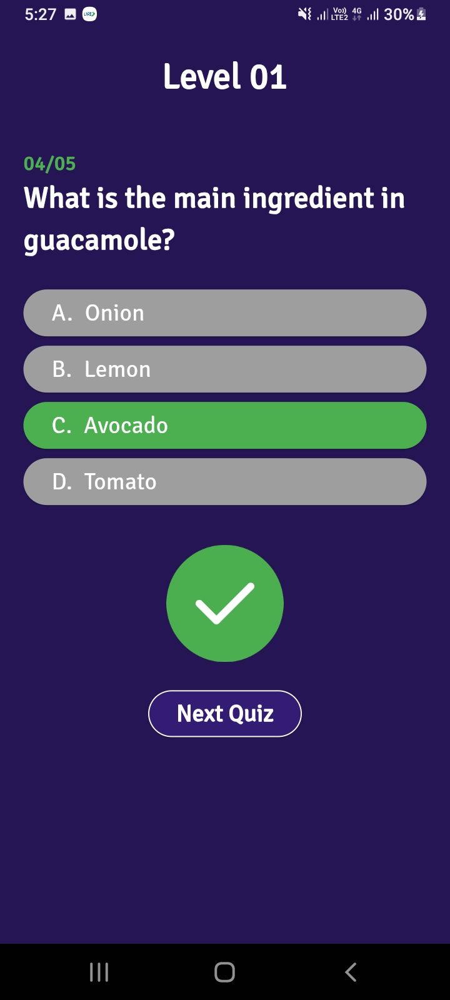

# Quiz Game in Flutter

## Description
A Flutter-based quiz game app that presents random MCQs from a wide range of topics to test users' knowledge in an engaging and interactive way.

### Features
- **Randomized Questions:** Offers unique quizzes each time.
- **Multiple Topics:** Includes diverse subjects like science, history, and technology.
- **Multiple Choice Format:** Provides options for each question.
- **Score Tracking:** Monitors user progress and scores.
- **Instant Feedback:** Displays correct answers.
- **Offline Mode:** Play quizzes without internet access.

## How to Run in Flutter

1. **Install Flutter**: Follow the [Flutter installation guide](https://flutter.dev/docs/get-started/install).
2. **Clone Repository**: 
   ```bash
   git clone https://github.com/username/quiz-game-flutter.git
   cd quiz-game-flutter

## Screenshots
   
